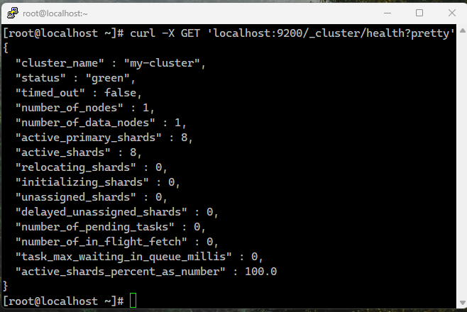
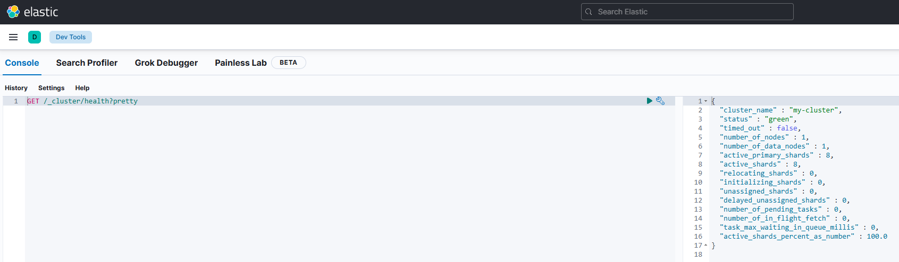

### Кононенко Александр  домашнее задание по теме ELK
---
 
 ## Задание 1. 
  <details><summary><b> Текст Задания. Elasticsearch</b> (нажмите, чтобы раскрыть)</summary>
<br>
  
  **Elasticsearch Установите и запустите Elasticsearch, после чего поменяйте параметр cluster_name на случайный
  Приведите скриншот команды:** 
   ``` 
  'curl -X GET 'localhost:9200/_cluster/health?pretty'
```

  **Сделанной на сервере с установленным Elasticsearch. Где будет виден нестандартный cluster_name.**


</details>


## Решение  




## Задание 2
<details><summary><b> Текст Задания. Kibana</b> (нажмите, чтобы раскрыть)</summary>
<br>

 **Установите и запустите Kibana.
приведите скриншот интерфейса Kibana на странице**
 
 ```
 http://<ip вашего сервера>:5601/app/dev_tools#/console, где будет выполнен запрос GET /_cluster/health?pretty.
```
</details>

## Решение

