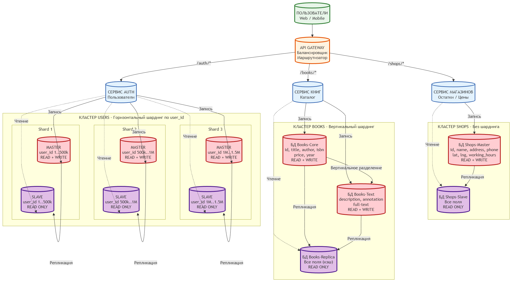

### Кононенко Александр  домашнее задание по теме: "Репликация и масштабирование. Часть 2"

---
 
 ## Задание 1. 
  

<b> Текст Задания.</b> (нажмите, чтобы раскрыть)

 
Задание 1 

Опишите основные преимущества использования масштабирования методами:
* Активный master-сервер и пассивный репликационный slave-сервер;
* master-сервер и несколько slave-серверов;
  Дайте ответ в свободной форме.

 

 ##  Решение 

  

<b> Первый вопрос Текст Решения.</b> (нажмите, чтобы раскрыть)

 
 
 Использование архитектуры с одним активным **master-сервером** и пассивным репликационным **slave-сервером** даёт следующие ключевые преимущества:

 * **Разгрузка чтения**
    * Чтение уходит на **Slave**,  **Master** занимается только записью.
 
 * **Высокая доступность и отказоустойчивость**
      
     * Горячий резерв: быстрый переход  на **Slave** при сбое **Master**.

 
 * **Аналитика и отчётность**
    
     * Тяжёлые аналитические запросы можно изолировать на **Slave**, исключая их влияние на операционную производительность **Master**.
 
 * **Простота и низкая стоимость**
   
      * Конфигурация  один **Master** — один **Slave** легко настраивается
      * Требует минимальных ресурсов и хорошо подходит для небольших и средних проектов на начальном этапе масштабирования.
 
* **Резервное копирование без нагрузки на master**

 

<b> Второй вопрос Текст Решения.</b> (нажмите, чтобы раскрыть)

 

Масштабирование с одним **master**-сервером и несколькими **slave**-серверами дополнительно расширяет эти возможности:

* **Горизонтальное масштабирование чтения** 
    * нагрузка распределяется по множеству реплик

* **Геораспределение** 
   * Slave серверы можно размещать в разных дата-центрах или регионах приближая данные к пользователям и снижая задержки.

*  **Разделение по  контурам**
    * одни реплики под аналитику другие под бекапы или тесты  без взаимных пересечений 
*  **Повышенная отказоустойчивость**
     
      * при падении **Master** есть несколько **Slave** на замену 

---

## Задание 2

<b> Текст Задания.</b> (нажмите, чтобы раскрыть)

  
Разработайте план для выполнения горизонтального и вертикального шаринга базы данных. База данных состоит из трёх таблиц:

 * пользователи
* книги
* магазины (столбцы произвольно).

   Опишите принципы построения системы и их разграничение или разбивку между базами данных.

   Пришлите блоксхему, где и что будет располагаться. Опишите, в каких режимах будут работать сервера.

 ##  Решение 

 

<b> описание принципов построения .</b> (нажмите, чтобы раскрыть)

  

**Общий принцип**
Система построена по архитектуре микросервисов: 
каждая таблица вынесена в отдельный сервис со своей базой данных. 
Единой общей БД нет — это устраняет узкое место и позволяет масштабировать каждую часть отдельно.
Для каждой таблицы выбран свой способ разбивки — в зависимости от характера данных и нагрузки.
Запросы приходят на API Gateway, который маршрутизирует их по нужному сервису:

* /auth/* → Сервис пользователей
* /books/* → Сервис книг
* /shops/* → Сервис магазинов

**Каждая таблица разбита по своему принципу: пользователи — по строкам (горизонтально), книги — по столбцам (вертикально), магазины — не делятся, только копируются. Запись идёт на Master, чтение — на Slave.**

<b> Диаграмма .</b> (нажмите, чтобы раскрыть)

  

 

