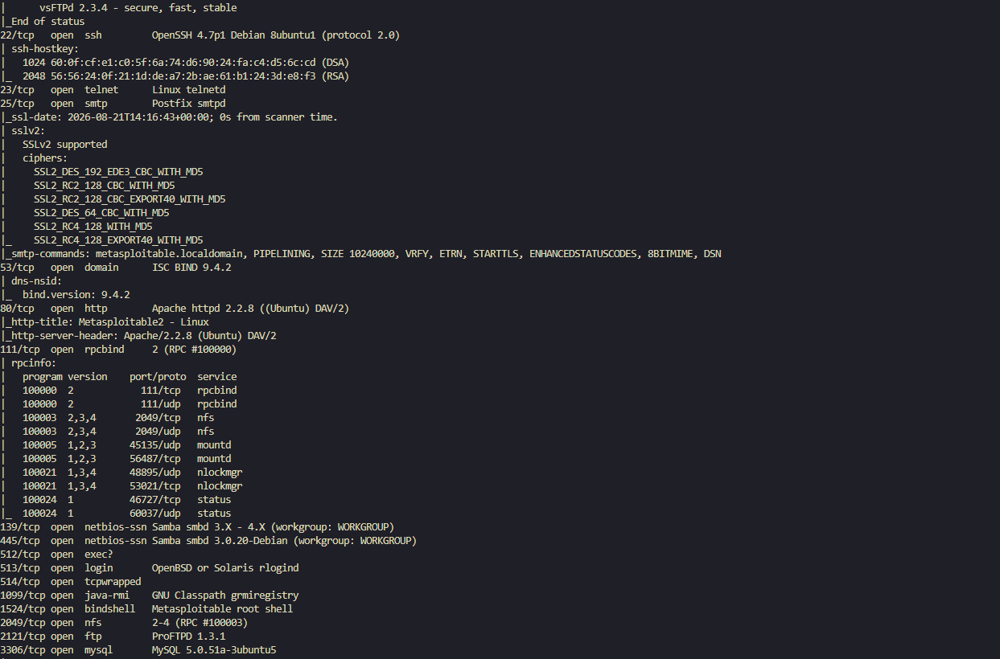

### Кононенко Александр  домашнее задание по теме: «Уязвимости и атаки на информационные системы»
---
 
 ## Задание 1. 
  

<b> Текст Задания.</b> (нажмите, чтобы раскрыть)

 
 

* Скачайте и установите виртуальную машину Metasploitable: https://sourceforge.net/projects/metasploitable/.
  Это типовая ОС для экспериментов в области информационной безопасности, с которой следует начать при анализе уязвимостей.
*  Просканируйте эту виртуальную машину, используя nmap.
* Попробуйте найти уязвимости, которым подвержена эта виртуальная машина.
* Сами уязвимости можно поискать на сайте https://www.exploit-db.com/.
Для этого нужно в поиске ввести название сетевой службы, обнаруженной на атакуемой машине, и выбрать подходящие по версии уязвимости.

* **Ответьте на следующие вопросы:**

    * Какие сетевые службы в ней разрешены?
    * Какие уязвимости были вами обнаружены? (список со ссылками: достаточно трёх уязвимостей)
   
     Приведите ответ в свободной форме.
  

  ---

  ## Решение 

<b> Текст Решения.</b> (нажмите, чтобы раскрыть)

 

**Разрешенные Сетевые службы** 

* FTP (21) 
* SSH (22) 
* Telnet (23)
* SMTP (25)
* DNS (53)
* HTTP (80)
* RPCBind (111)
* Samba/NetBIOS (139- 445)
* Exec (512)
* Login (513)
* Shell (514)
* Java RMI (1099)
* Bindshell (1524)
* NFS (2049)
* FTP (2121) 
* MySQL (3306)
---

**Найденные уязвимости**
* **vsftpd 2.3.4 Backdoor Command Execution (порт 21)**
   https://www.exploit-db.com/exploits/17491

* **Samba "username map script" Command Execution (порты 139/445)**
https://www.exploit-db.com/exploits/16320

* **Apache HTTPD 2.2.8 Range Header DoS (порт 80)**
 https://www.exploit-db.com/exploits/18221

 ## Задание 2. 
  

<b> Текст Задания.</b> (нажмите, чтобы раскрыть)

 

* Проведите сканирование Metasploitable в режимах
    * SYN
    * FIN
    * Xmas
    * UDP
* Запишите сеансы сканирования в Wireshark

Ответьте на следующие вопросы:

* Чем отличаются эти режимы сканирования с точки зрения сетевого трафика?
* Как отвечает сервер?

Приведите ответ в свободной форме.

 ## Решение 

<b> Текст Решения.</b> (нажмите, чтобы раскрыть)

 

**отличия режимов сканирования по трафику**

* SYN – отправляется TCP-пакет с одним флагом SYN ([SYN]).
* FIN – отправляется TCP-пакет с одним флагом FIN ([FIN]).
* Xmas – отправляется TCP-пакет с тремя флагами: FIN, PSH и URG ([FIN, PSH, URG]).
* UDP – отправляются UDP-дейтаграммы (без TCP-флагов).
  
   
  
---
**ответ сервера** 

| Режим сканирования | Открытый порт | Закрытый порт |
|--------------------|---------------|---------------|
| **SYN** (`-sS`)    | `SYN-ACK`     | `RST`         |
| **FIN** (`-sF`)    | нет ответа    | `RST`         |
| **Xmas** (`-sX`)   | нет ответа    | `RST`         |
| **UDP** (`-sU`)    | данные или нет ответа | `ICMP Port Unreachable` |

