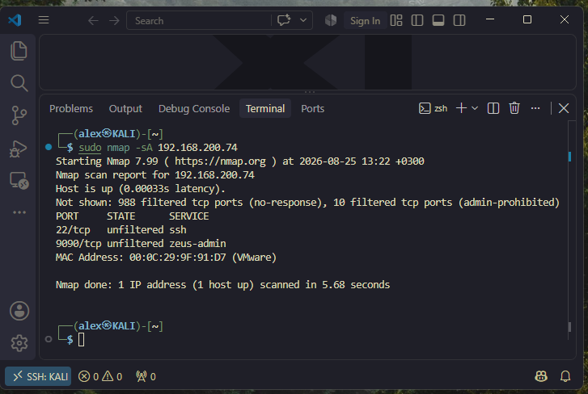

### Кононенко Александр  домашнее задание по теме: "Защита-Сети"

---
 
 ## Задание 1. 
  <details><summary><b> Текст Задания.</b> (нажмите, чтобы раскрыть)</summary>
<br>
Задание 1 
Проведите разведку системы и определите, какие сетевые службы запущены на защищаемой системе:

* sudo nmap -sA < ip-адрес ></ip-адрес>
* sudo nmap -sT < ip-адрес >
* sudo nmap -sS < ip-адрес >
* sudo nmap -sV < ip-адрес >
  
По желанию можете поэкспериментировать с опциями: https://nmap.org/man/ru/man-briefoptions.html.
В качестве ответа пришлите события, которые попали в логи Suricata и Fail2Ban, прокомментируйте результат.
</details>

## Решение 
<details><summary><b> Команда sudo nmap -sA </b> (нажмите, чтобы раскрыть)</summary>
<br>

1. ACK Scan (-sA)
Команда: ```sudo nmap -sA 192.168.200.74```



Результат: порты 22 и 9090
                                            
                                              
  ###                                              Suricata

* **Алерты отсутствуют ACK-сканирование не детектируется стандартными правилами Suricata
                              так как ACK-пакеты выглядят как обычный сетевой трафик**

### Fail2Ban

* **Алерты отсутствуют Fail2Ban не реагирует на сканирование портов, так как это не попытка аутентификации**
