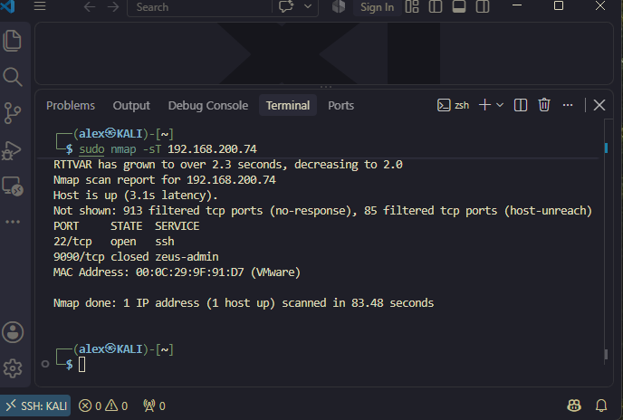
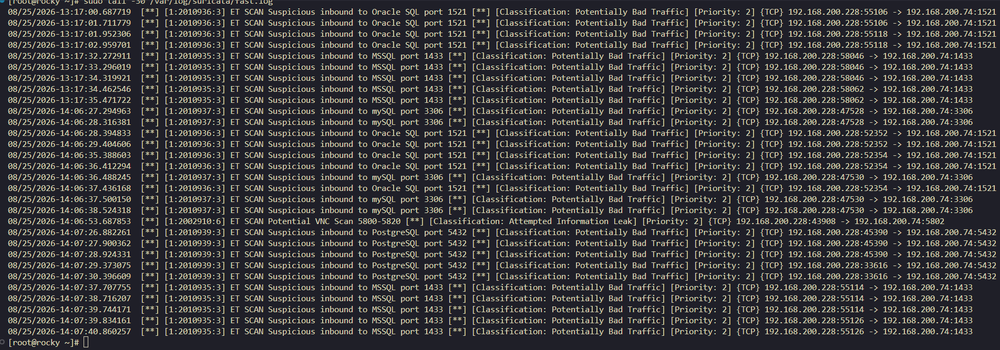
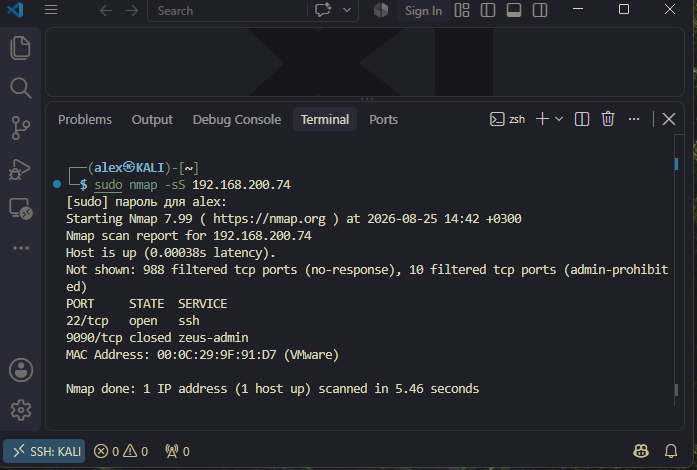
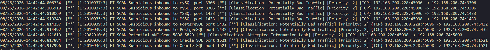
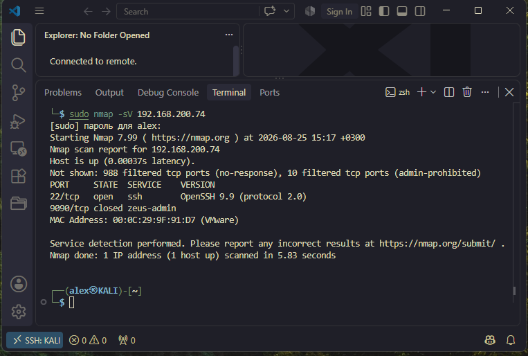
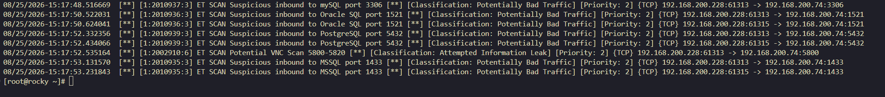

### Кононенко Александр  домашнее задание по теме: "Защита-Сети"

---
 
 ## Задание 1. 
  <details><summary><b> Текст Задания.</b> (нажмите, чтобы раскрыть)</summary>
<br>
Задание 1 
Проведите разведку системы и определите, какие сетевые службы запущены на защищаемой системе:

* sudo nmap -sA < ip-адрес ></ip-адрес>
* sudo nmap -sT < ip-адрес >
* sudo nmap -sS < ip-адрес >
* sudo nmap -sV < ip-адрес >
  
По желанию можете поэкспериментировать с опциями: https://nmap.org/man/ru/man-briefoptions.html.
В качестве ответа пришлите события, которые попали в логи Suricata и Fail2Ban, прокомментируйте результат.
</details>

## Решение 
<details><summary><b> Команда sudo nmap -sA </b> (нажмите, чтобы раскрыть)</summary>
<br>

1. ACK Scan (-sA)
Команда: ```sudo nmap -sA 192.168.200.74```

Действие Команды:

* Отправляет TCP-пакеты с установленным флагом ACK на все порты целевой системы

* Используется для определения правил файрвола


Результат: порты 22 и 9090
                                            
                                              
  ###                                              Suricata

* **Алерты отсутствуют ACK-сканирование не детектируется стандартными правилами Suricata
                              так как ACK-пакеты выглядят как обычный сетевой трафик**

### Fail2Ban

* **Алерты отсутствуют Fail2Ban не реагирует на сканирование портов, так как это не попытка аутентификации**

</details>

<details><summary><b> Команда sudo nmap -sT </b> (нажмите, чтобы раскрыть)</summary>
<br>

 2.TCP Connect Scan (-sT)
Команда:```sudo nmap -sT 192.168.200.74```

Действие команды

* Устанавливает полное TCP-соединение с каждым портом (трёхстороннее рукопожатие)
* Самый надёжный но самый заметный тип сканирования

Результат сканирования:
Порт 22/tcp (SSH) открыт

Порт 9090/tcp закрыт

Остальные порты  фильтруются



---

###                  События в Suricata

отображение попыток подключения  п портам баз данных 
Suricata обнаружила множественные попытки подключения к портам баз данных:




* MySQL (3306) 
* Oracle SQL (1521)
* PostgreSQL (5432)
* MSSQL (1433)
* VNC Scan (5800-5820)
---
### События в Fail2Ban

* Алерты Отсутствуют (сканирование портов не является попыткой аутентификации)


</details>


<details><summary><b> Команда  sudo nmap -sS</b> (нажмите, чтобы раскрыть)</summary>
<br>

 3.SYN Scan (-sS)    
Действие команды ```sudo nmap -sS 192.168.200.74```

* Отправляет SYN-пакеты (начало TCP-соединения) на порты
* Не завершает рукопожатие (stealth-сканирование)
* Быстрее и менее заметен чем TCP Connect Scan




Результат сканирования:
* Порт 22/tcp (SSH) открыт
* Порт 9090/tcp закрыт
* Остальные порты — filtered

---

 ###                  События в Suricata


**Новые Алерты в 14:42:44 - 14:42:46**

* MySQL (3306) 
* MSSQL (1433)
* PostgreSQL (5432)
* VNC Scan (5800) 
* Oracle SQL (1521)



---
### События в Fail2Ban

* Алерты Отсутствуют(нет попыток аутентификации)

</details>


<details><summary><b> Команда Version Detection (-sV): </b> (нажмите, чтобы раскрыть)</summary>
<br>

 4.Version Detection (-sV)

Действие команды ```sudo nmap -sV 192.168.200.74```

Что делает команда
* Определяет версии служб на открытых портах
* Отправляет специфические запросы к сервисам для получения баннеров

Результат сканирования:

* Порт 22/tcp (SSH) — OpenSSH 9.9 (protocol 2.0)
* Порт 9090/tcp — закрыт

  

---

###                                              Suricata


Новые Алерты в 15:17:48 - 15:17:53:

* MySQL (3306)
* Oracle SQL (1521)
* PostgreSQL (5432) 
* VNC Scan (5800)
* MSSQL (1433) 




---
###                     События в Fail2Ban

Отсутствуют( сканирование портов не попыткой аутентификации) 

</details>

--- 


 ## Задание 2. 
  <details><summary><b> Текст Задания.</b> (нажмите, чтобы раскрыть)</summary>
<br>

* Проведите атаку на подбор пароля для службы SSH:
   hydra -L users.txt -P pass.txt < ip-адрес > ssh

             * Настройка hydra:
             * Cоздайте два файла: users.txt и pass.txt;
             *  в каждой строчке первого файла должны быть имена пользователей, второго — пароли.
  В нашем случае это могут быть случайные строки, но ради эксперимента можете добавить имя и пароль существующего пользователя.
Дополнительная информация по hydra: https://kali.tools/?p=1847.

* Включение защиты SSH для Fail2Ban:
        * открыть файл /etc/fail2ban/jail.conf,
        *  найти секцию ssh,
        * установить enabled в true.


